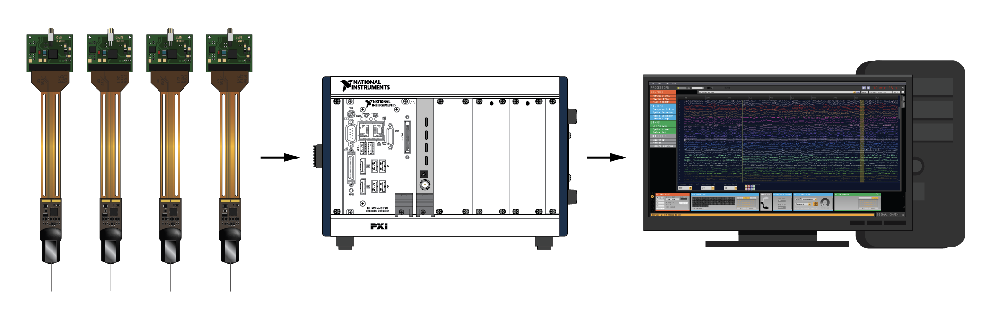

# Neuropixels PXI Plugin

This plugin makes it possible to stream Neuropixels data from a PXI-based  acquisition system into the [Open Ephys GUI](https://github.com/open-ephys/plugin-gui).

## Installation

This plugin is not included by default, but must be added via the GUI's Plugin Installer. To access the Plugin Installer, press **ctrl-P** from inside the GUI. Once the installer is loaded, browse to the "Neuropix-PXI" plugin, and click "Install."

If you're upgrading from a previous version, you will need to close and re-open the GUI before you can use the plugin in a signal chain.

## Hardware requirements

- PXI chassis and remote control module

- PCIe interface card housed in the computer

- Cables to connect the remote control module to the PCIe card

- One or more Neuropixels PXIe modules (available from IMEC)

- Neuropixels cables, headstages, and probes (available from IMEC)

## Compatible probes

- Neuropixels 1.0

- Neuropixels 2.0 (single shank and multishank)

- Neuropixels Ultra

- Neuropixels NHP (active and passive)

## Documentation

For more information, please read through the documentation page [here](https://open-ephys.github.io/gui-docs/User-Manual/Plugins/Neuropixels-PXI.html).

## License

This source code is made available under a [GPL 3.0 License](LICENSE).

## Credits

This plugin was created by Josh Siegle, Pavel Kulik, and Anjal Doshi at the Allen Institute.

We thank Bill Karsh (Janelia) and Jan Putzeys (imec) for helpful advice throughout the development process.

© 2020 Allen Institute and Open Ephys
